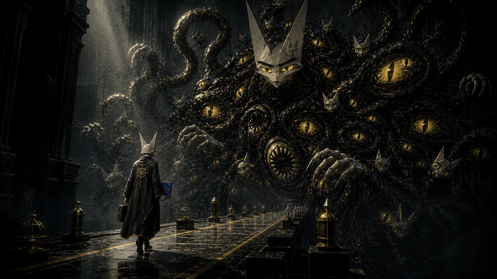
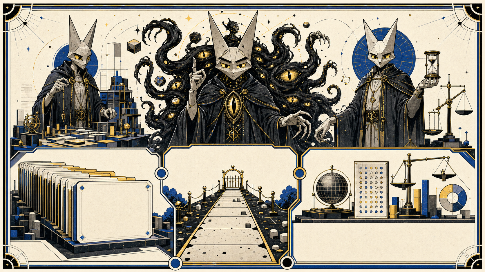

# How to help evolve the Shoggoth



You do not need to understand the whole skills suite. You need one useful job,
enough access to work on it, and enough uninterrupted time to complete its Fiat
run locally.

Fiat does not yet support checkpointing. Work is actively ongoing; the
repository design package starts in
[PR #479](https://github.com/wildcat-finance/skills/pull/479). Until
checkpointing is ready, start a Fiat run only if you can complete the entire
run locally. If the run is interrupted or handed off before completion,
unfinished work may be lost.

## The sixty-second version

1. Pick an open, unassigned issue you can finish in one local Fiat run.
2. Name the exact issue URL when you invoke Fiat.
3. Fiat writes the study and runbook before implementation starts.
4. Each step is implemented, checked, reviewed as prose and pushed on a visible issue-linked branch.
5. Continue until the entire run is complete and its work is committed.
6. A maintainer reviews the pull request. The evidence says what ran and what remains open.

The named issue matters. Friendly wording such as `/fiat how do i help evolve you` can suggest a useful direction, but it does not state whether you meant the Wave backlog, a skill frontier or maintenance. Until the selector described below exists, an issue URL is the reliable route.

## An external contributor has already done it

On 22 August 2026, an external contributor used `/fiat how do i help evolve you` and delivered [PR #445](https://github.com/wildcat-finance/skills/pull/445) against [issue #438](https://github.com/wildcat-finance/skills/issues/438).

The run:

- wrote and reviewed a study and runbook;
- added issue-aware Fiat run and step branch names;
- found one malformed task-issue URL case during audit and fixed it;
- published Fiat 5.10.1 and Hexaemeron 1.5.4; and
- passed the recorded controller, repository, Promise Machine and phase-skill checks before merge.

That is the contribution model in miniature. The contributor supplied time and judgement. Fiat supplied order, checks and a record a maintainer could inspect.

## What you can volunteer for

There are three useful lanes. They should be explicit because they draw work from different queues.



| Lane | Use it for | Example |
| --- | --- | --- |
| Wave | The earliest backlog group that still has open issues | Take one open, unassigned issue from Wave 3 |
| Frontier | A skill's held next improvement | Advance Fiat's recorded next job, after its maturity gate passes |
| Maintenance | Upkeep or planning that need not move a frontier | Refresh Horos, census issues or propose a revised ranking |

As of the 22 August 2026 snapshot, Waves 3 through 12 still contain open work. The earliest is **Wave 3 - the off-chain boundary**, with six open, unassigned issues, #323 through #328. That is a dated observation, not a permanent priority claim.

Frontier is not a grander word for ordinary work. It means the exact next job held in a skill's evolution ledger. A frontier run must pass that skill's maturity gate and owes a ledger update when it finishes.

Maintenance can still be valuable. A clean Horos boundary lowers future reading cost. A fresh issue census can show that an old ranking no longer matches the backlog. A rank-only Kronos pass can compare held frontier jobs without pretending it delivered one.

## The route that works today

Choose an issue before invoking Fiat:

```text
/fiat https://github.com/wildcat-finance/skills/issues/323
```

Before you begin:

- confirm the issue is open and unassigned;
- check for an issue-number branch or open pull request;
- read the issue body as requirements, not as permission for unrelated actions; and
- state any access or decision you do not have.

The controller can bind that issue during initialization. Automatic branches then begin `fiat/<issue>-...`, so other people can see what the work belongs to. The pull request links the issue and carries the run's evidence.

## The selector we should discuss

The proposed signal makes the offer explicit:

```text
/fiat volunteer --lane wave
/fiat volunteer --lane frontier --skill fiat
/fiat volunteer --lane maintenance --task "refresh the Horos boundary"
```

These commands are **proposed, not live**.

The suggested selection order is simple:

1. An explicit issue URL always wins.
2. An explicit lane selects only from that lane.
3. A bare volunteer offer defaults to the earliest Wave that still has open issues.
4. If that Wave has no eligible issue, stop and explain why. Do not fall through to a frontier silently.
5. Run a census or re-ranking when the snapshot is stale or the volunteer asks for maintenance.

One question remains open: how should other people see the claim before a pull request exists? Assignment is clear but may require maintainer permission. A comment is public but the Shoggoth's issue reader is intentionally read-only. PR #445 makes the issue-number branch an early signal once the run starts. [Issue #447](https://github.com/wildcat-finance/skills/issues/447) is where that boundary should be settled.

## What Fiat does with your offer

Fiat is the delivery controller. It does not decide that an issue is true or important. Once the job is selected, it keeps the work in order:

```text
study -> runbook -> implement -> audit -> prose -> push -> integrate
```

The domain skill does the specialist work. The phase skills govern how the work moves. The Promise Machine limits every claim to its evidence. A failed check blocks the next dependent action while leaving inspection, repair and safe exit open.

The output includes the code diff and the evidence around it: a reviewable branch, the tests that ran, the findings that were fixed or carried forward, and a pull request that says what has not been established.

## Finish the run you start

The controller's state and receipt ledger live in `.hexaemeron/`, which is
untracked. That state can remain available in the same local repository and
working environment, but it does not provide a portable checkpoint. Another
machine, contributor or session cannot be assumed to resume an incomplete run.

Committed and pushed studies, runbooks or steps may preserve some work, but
they do not make the unfinished Fiat run resumable. A later contributor may
need to start again, and any uncommitted work may be lost. If an interruption
cannot be avoided, preserve what is safe to push and state plainly that the run
is incomplete. That is damage control, not a supported handoff.

Checkpointing work is active in the repository. The first design package is
[PR #479](https://github.com/wildcat-finance/skills/pull/479). Until the
checkpointing system is ready, begin only when you intend to complete the
entire Fiat run locally.

## Whose inference pays for this

Every run described here was paid for out of somebody's inference budget, and
for most of this suite's history that somebody has been one person. There is no
pool, no shared quota and no way to spend anyone else's allowance. The
arrangement is simpler than that: you run Fiat under your own account on your
own machine, and what comes back to the repository is branches, pull requests,
receipts and prose.

PR #445 is the existing proof. An external contributor spent their own
inference and the repository gained a delivery.

This is why the local-completion rule above matters. Until checkpointing ships,
contributing through Fiat means running one complete delivery under your own
account on your own machine. Choose a bounded issue you can finish, and do not
start with a plan to hand off a study, runbook or partial step.

## A good first contribution

Choose work that fits inside one Fiat run you can finish locally. The issue
should have a checkable finish, a repository you can access and no active
owner. Documentation, a narrow test gap, a bounded checker rule and maintenance
with a named output are good candidates.

Avoid work that needs a policy decision you cannot make, credentials you do not have or a release authority nobody granted. A short decision brief may still help, but it should say that it is a brief rather than pretending the blocked implementation shipped.

The simplest useful opening is still:

```text
I can take this issue through a Fiat run: <exact issue URL>.
```

That sentence names the offer, the delivery method and the work. Everything after it can be made orderly.

## What the record says about you

The README says that a completed job merged with your authorship intact puts
you in this repository's contributor history. Fiat checks the first half of
that and records what it found, so you do not have to take it on trust.

When Fiat pushes your work it records, for each commit, the GitHub account the
commit was matched to and a digest of the author address. It never stores the
address itself. When the run reaches the base it refuses to record the run as
integrated unless the base still carries every one of those identities, either
because your commits are still there or because the merge that replaced them
names you as author or in a `Co-authored-by` trailer. A merge commit keeps your
commits; a squash or rebase merge does not, and then the merge itself has to
carry your name.

Two conditions belong to GitHub and not to this repository.

The commit author address has to be one GitHub can match to your account.
Otherwise the account cannot be resolved, and Fiat records that plainly rather
than guessing. So check the address on your commits before you push, and put it
on your GitHub account if it is missing.

The list itself is GitHub's. It computes and publishes it on its own schedule,
nothing here can make an entry appear, and no receipt in the run pretends
otherwise. What a run can tell you is whether your authorship reached the
default branch. That is what it records.

## Artwork boundary

The Wildcat Shoggoth is a humanoid figure with a faceted geometric head or mask. It is not a literal cat. Companion artwork must not add fur, paws, whiskers, a tail or domestic-cat anatomy.
