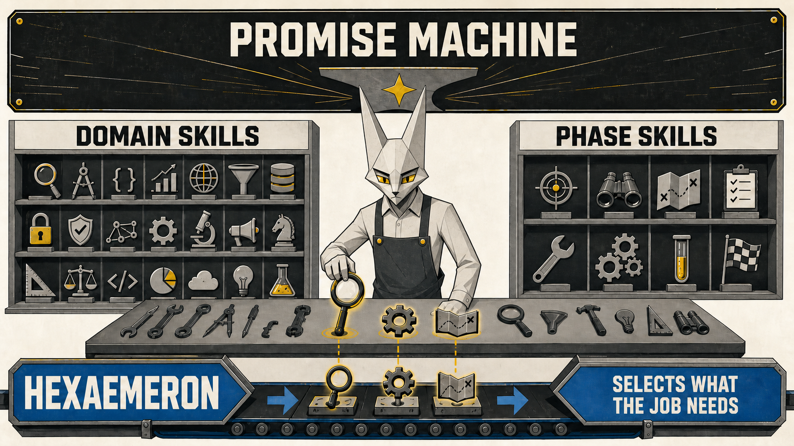
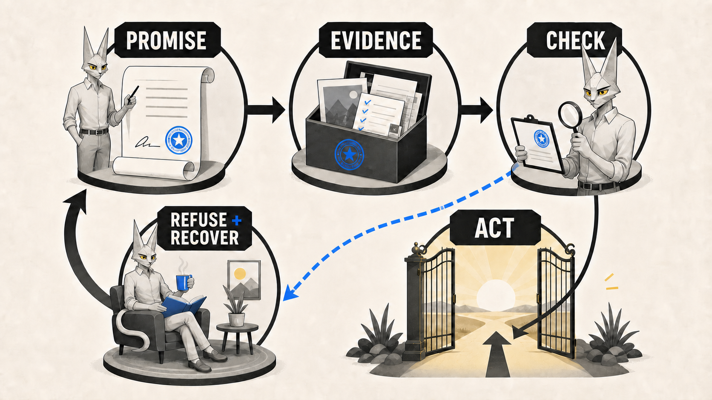

# The Promise Machine, explained properly

## A field guide to Wildcat Labs Skills, Hexaemeron, and the part where saying “Fiat” does not summon a daemon

Wildcat Labs Skills is a collection of specialist working methods for agents. Some preserve evidence. Some inspect contracts. Some reconstruct credit history. One runs a complete delivery. They share a common rule: every result must stay inside the evidence that produced it.

That shared rule is the **Promise Machine**. The specialist methods are **skills**. **Hexaemeron** is the delivery system that can select the right skills, put work through a visible sequence, and retain evidence that each required stage happened. **Fiat** is the explicit entry point and controller for that delivery system.

The shortest honest description is this:

> The Promise Machine defines what may be claimed. Skills do the specialist work. Hexaemeron organises a delivery. Fiat moves it one evidenced step at a time.

## 1. The whole framework in one page

Think of a well-run workshop.

The **Promise Machine** is the workshop’s law. It says that a test certificate covers the test that actually ran, on the thing that was actually tested. It does not become a universal guarantee because somebody likes the result.

**Domain skills** are the specialists. One preserves historic Ethereum state. Another checks hook behaviour. Another builds a sourced counterparty dossier. They have different tools because they answer different questions.

**Phase skills** are working disciplines used across many subjects. They ask whether the problem was specified before work began, whether a new boundary is guarded, whether an unattended service can be understood at 3 a.m., whether a speed claim has measurements, whether a failure was fixed at its cause, and whether an important decision was recorded where somebody will find it.

**Hexaemeron**, usually shortened to **Hex**, is the production line. It studies the request, writes the runbook, implements each step, audits it, fixes the writing, opens reviewable changes, and lands the whole run once. It does not contain all knowledge itself. It calls the right specialists and disciplines.

**Fiat** is Hex’s foreman and ledger. It gives one instruction at a time and will not advance until the required evidence is recorded. The model does the work. Fiat decides what comes next.

This is why “type the thing and say Fiat” appears to work. The phrase is not a spell. It is explicit authority to start a controlled delivery in a named repository. The first thing Hex produces is a study of what the request should mean. Only then does it produce a plan that can be checked.

*Figure 1. One law, two kinds of skill, one delivery system. Hex selects what the job needs; it does not empty the entire tool cabinet onto every task.*

| Layer | Its job | It does not mean |
| --- | --- | --- |
| Promise Machine | Sets the evidence boundary for every claim and action | One central tool does all the work |
| Skills | Perform bounded specialist work | Every skill must run on every job |
| Hexaemeron | Manages a full delivery and selects the skills it needs | A completed process guarantees a perfect result |

## 2. The Promise Machine

The Promise Machine is the common contract across the Wildcat Labs suite. Its governing sentence is plain:

> No skill may claim more than its evidence establishes, or authorise a more consequential transition than that evidence warrants.

It turns a vague idea of “the agent checked it” into a small, inspectable chain:

1. **Promise.** What narrow claim can this operation make?
2. **Evidence.** What exact record, test, measurement, proof, or source supports it?
3. **Boundary.** What nearby conclusion is tempting but unsupported?
4. **Authorised action.** What may happen if the promise holds?
5. **Refusal and recovery.** What action stops if it does not hold, and how can somebody inspect, repair, rerun, or leave safely?

The refusal is deliberately contained. If a gate for a new draw fails, it should stop that draw. It should not prevent repayment, investigation, or cure. Applied to software, a failed release gate stops publication, not diagnosis or rollback.

*Figure 2. Evidence is checked before an action opens. A failed check takes the safe route: refuse the dependent action, keep recovery available, then try again with better evidence.*

### Evidence has names

The contract distinguishes several relationships between a claim and its support:

- **Checked** means a named rule or schema accepted the subject.
- **Measured** means a value was observed using a recorded method and environment.
- **Recorded** means bytes or a statement were preserved from an identified source.
- **Attested** means an identified actor or system made the statement.
- **Proved** means a named proof relation accepted the subject.
- **Inferred** means a conclusion follows from named evidence under a stated rule.
- **Unknown** means the matter was not established.

These are not medals arranged from weak to strong. They describe different relationships. An attestation may prove who said something without proving the statement true. A measurement can establish performance on one workload without establishing performance everywhere.

### Consequence grows with evidence

The Promise Machine assigns the **action**, not the whole skill, one of four consequence levels:

| Level | What the result may authorise | Expected care |
| --- | --- | --- |
| 0 | A response or presentation | Preserve scope, meaning, and uncertainty |
| 1 | A derived artefact | Check structure, source, and visible gaps |
| 2 | A repository or durable-data change | Tests, negative evidence, and a recoverable change |
| 3 | Publication, deployment, external action, or a security or financial conclusion | A fail-closed gate, recorded authority, and independently inspectable evidence |

A rewrite can sit at level 0. A generated evidence file may sit at level 1. A code change belongs at level 2. Merging, deploying, or issuing a security conclusion belongs at level 3.

### Composition cannot wash away caveats

Skills can pass work to one another, but the hand-off carries the subject, scope, evidence class, time boundary, and unresolved gaps. A later skill can narrow the evidence or add new evidence. It cannot upgrade “recorded RPC response” into “proved chain truth,” or turn a bounded hook search into “the hook is safe.”

This is the architectural point. The suite is useful because skills compose. It is trustworthy only if their boundaries compose too.

### What the Promise Machine is not

It is not Hexaemeron, not Fiat, and not a universal receipt format. It does not force every skill into one controller. It does not establish that a source told the truth, that a model is correct, or that a clean check proves perfection. It governs the claim and the next action.

## 3. Domain skills: specialists with narrow jobs

“Domain skill” is a useful explanatory label rather than a separate package type. It means a skill whose job is tied to a subject, artefact, or decision. Most can run by themselves. Hex may select one when a delivery needs its work.

### Reading and source preparation

- **Horos** draws an evidence-backed reading boundary around a repository. It classifies generated files, vendored trees, lockfiles, large blobs, and other token sinks so an agent begins with the part worth reading.
- **Lemma** turns Solidity compiler inputs or Markdown trees into source-linked JSONL chunks. Quotation text stays distinct from text prepared for a model or an embedding.

### Preserving and reconstructing evidence

- **Alexandria** preserves lending-protocol captures by digest and derives only the address-scoped credit view a reviewed mapping supports.
- **Lazarus** captures the finite part of historical Ethereum state and exact RPC evidence needed by a test, checks the proof-backed part, and replays only exact recorded requests.
- **Tabularium** rebuilds reproducible credit-event records from preserved venue-native data without flattening every venue into a misleading common story.

### Credit research and grounded releases

- **Probitas** builds a sourced dossier from wallet addresses a counterparty declared. It reports borrowing and repayment evidence, keeps coverage gaps visible, and does not claim to identify a person or issue a Wildcat verdict.
- **Berean** binds an agent release to a pinned document corpus, exact citations, block-bound reads, evaluation cases, and promotion records. It lets a stranger check what an answer rested on without treating the model as the authority.
- **Ariadne** writes and verifies evidence statements that bind an artefact digest to the build, test, review, or deployment record behind it. The statement says what evidence covers; it does not invent signer identity or truth.

### Contracts and protocol behaviour

- **Pandects** expresses credit-system laws as executable Solidity components, each paired with a deliberately broken specimen the law must catch.
- **Janus** checks what a contract hook may observe and change before and after a host action. Its result stays bound to the named host adapter, manifest, recorder, and bounded search.
- **Hermes** changes Solidity gas use only inside a measured Foundry loop. Each candidate names a rule, reruns behaviour checks, compares storage and selectors, and is kept only when the evidence shows a real saving.

### Communication and interaction

- **Brevitas** applies evidence-preserving structural limits to engineering prose. It cuts padding without cutting addresses, numeric claims, counterexamples, or explicit unknowns.
- **Sapheneia** shapes replies for AuDHD readers by keeping the action, boundary, state, evidence, and next step visible.

These skills do not become parts of Hex simply because they are in the same suite. Their independence matters. A researcher can use Probitas without running a software delivery. An auditor can use Janus without opening a Fiat run. Hex is a customer of specialist skills, not their owner.

## 4. Phase skills: disciplines that travel between jobs

Hexaemeron contains six first-party phase skills. Each has a clear home in the delivery loop and can also run by itself.

| Skill | Plain-English question | Where Hex uses it |
| --- | --- | --- |
| **Protasis** | Have we stated the problem, assumptions, trade, risks, and checkable finish before building? | Study and runbook |
| **Phylax** | What new boundary accepts outside data, commands, URLs, secrets, dependencies, or model output, and what control guards it? | Implementation and non-Solidity review |
| **Ephoros** | What questions will somebody ask when this runs unattended, and what events, metrics, traces, or alerts answer them? | Implementation and non-Solidity review |
| **Metron** | Is a performance change backed by the same measurement before and after, outside the noise, with correctness still green? | Implementation when speed is in scope |
| **Elenchus** | Can we reproduce the observed failure, find its mechanism, fix that cause, and leave a test that fails without the fix? | Implementation and audit failures |
| **Hypomnema** | Which decisions must outlive the people making them, and where will the next person look for the reason? | Prose and durable records |

The important word is **when**. Metron does not run because performance exists as an abstract concern. It runs when the study names a budget or somebody proposes a speed change. Elenchus does not roam for hypothetical bugs. It starts when a failure has actually appeared. Ephoros applies when a thing will run unattended or needs operational signals.

This keeps the framework from becoming a ceremonial checklist. The study names the disciplines a step incurs and why. Later review can then ask whether the promised discipline actually ran.

Two more skills shape prose but are not phase disciplines in the same sense:

- **Imprimatur** checks shipped prose for a defined set of machine-writing habits and unsupported technical phrasing.
- **Vulgate** rewrites the surface into plain human language while keeping every fact, caveat, and commitment unchanged.

Hex runs Hypomnema first to decide what must be recorded, then Imprimatur, then Vulgate. Meaning first, presentation second.

## 5. Hexaemeron: the delivery system

Hexaemeron takes one topic through a full repository delivery. Its name refers to six days of ordered creation and then rest. The joke is visible in the sequence, but the machinery is practical.

1. **Study.** Protasis turns the topic into a proposition: problem, audience, assumptions, current state, options, chosen trade, risks, boundaries, success checks, and records.
2. **Runbook.** The study becomes discrete steps. Each step has an exact entry, exit command, files, tests, and applicable disciplines.
3. **Implement.** Hex builds the least complicated construction that satisfies the step. It applies Phylax, Ephoros, Metron, or Elenchus when the step calls for them.
4. **Audit.** The step is reviewed in rounds. Solidity work uses the bundled X-Ray, Solidity Auditor, and Fizz suite. Findings are fixed on the step branch and another round runs. Non-Solidity work runs the applicable phase checks.
5. **Prose.** Hypomnema places the records. Imprimatur and Vulgate clean the shipped documents and pull-request text without changing their substance.
6. **Push.** The step is signed, pushed, and opened as a pull request against the step below it.
7. **Integrate.** Once every step is ready, the stack merges in order into the run branch. The run branch then lands on the base once.

*Figure 3. One job moves through visible stations. The audit may send work back to implementation. Each completed stage leaves a receipt, and the base branch receives one final integration rather than a trail of partial changes.*

### Fiat: controller, ledger, and gatekeeper

Fiat is the explicit Hex entry skill. A deterministic controller called `hexctl` stores state under `.hexaemeron/` and emits one next action. The agent performs that action, records its receipt, and asks again.

Conversation is not the source of truth. The state and hash-chained ledger are. If a session resets, the controller can reconstruct the next packet from durable artefacts and state. If a required receipt is absent or malformed, Fiat refuses to advance.

The controller is intentionally narrower than the work. It can prove that required transitions and receipt shapes occurred in order. It cannot prove that a test summary is true, that an audit judgement is correct, or that the implementation has no defects. Those claims belong to the evidence recorded by the relevant skill.

### Branches show the shape of the work

A run has one integration branch and a stack of step branches. Step 1 targets the run branch. Step 2 targets Step 1. A reviewer sees one step’s change rather than the whole programme. Nothing lands on the base during the steps. At the end, the stack collapses in order and the run reaches the base through one integration.

This is workflow evidence rather than administrative theatre. The branch shape records dependency order, keeps each review small, and prevents a half-built sequence from leaking into the base.

### The bundled security suite

Hex ships a third-party Pashov suite for Solidity work:

- **X-Ray** creates pre-audit views of the named repository, likely attack paths, invariants, integrations, tests, and history.
- **Solidity Auditor** runs the prescribed security-review roles over the named scope and combines their results only after all have returned.
- **Fizz** builds or refreshes an Echidna or Medusa stateful fuzz harness and records the campaign that actually ran.

These instructions remain upstream-owned and unchanged. Wildcat’s claims about their outputs live in digest-bound overlays. If upstream bytes change, the overlay stops applying until reviewed. That is the Promise Machine guarding provenance without pretending Wildcat authored the method.

### Kronos: the optional loop around Fiat

Kronos ranks held, eligible skill-frontier jobs, selects the most worthwhile one, sends it through a complete Fiat run, then ranks again. It is useful for advancing the skills suite itself. It is not part of an ordinary product delivery, and it stops when there is no eligible frontier worth seasoning further.

## 6. How Hex chooses skills

Hex does not run every skill. Selection follows four questions.

1. **What is the job about?** That selects domain skills. A historical-state fixture points to Lazarus. A hook boundary points to Janus. A counterparty lending record points to Probitas.
2. **What does this step introduce?** That selects phase skills. A new URL fetch invokes Phylax. An unattended worker invokes Ephoros. A speed claim invokes Metron. A red test invokes Elenchus.
3. **What is being shipped?** Solidity activates the bundled security suite. Prose activates the record and voice sequence. A repository change activates signed commits, branch gates, and review.
4. **What evidence exists now?** A skill may run only when its preconditions exist. No failure means no Elenchus diagnosis. No baseline means no performance change. Missing evidence blocks the dependent action.

### Worked example: a source-grounded credit agent

Suppose the topic is: “Build an agent that answers questions about a borrower’s historic lending activity, with citations a reviewer can check.”

Protasis would first pin down the subject, declared addresses, venues, time range, source classes, demo questions, and what “checkable” means. The runbook might then split the work into preserved evidence, credit-event reconstruction, answer generation, and release evidence.

The domain selection could be:

- Alexandria to preserve and digest the heterogeneous lending captures.
- Tabularium to turn venue-native records into qualified credit events.
- Probitas to build the address-scoped borrowing dossier.
- Lemma to prepare source-linked text chunks when documents are involved.
- Berean to bind answers to pinned bytes, chain reads, and evaluations.
- Ariadne to attach the final release digest to its evidence statement.

The phase selection depends on each step:

- Phylax guards RPC responses, fetched documents, subprocesses, paths, credentials, and model output.
- Ephoros applies if harvesting or answering runs unattended.
- Metron applies only if the study sets a response-time or harvest-time budget.
- Elenchus starts when a test, build, or evaluation actually fails.
- Hypomnema records expensive choices such as the event schema or evidence-class mapping.

Hex then manages the delivery sequence, receipts, branch stack, audit rounds, prose, and integration. The Promise Machine keeps the hand-offs honest. A recorded venue response does not become proved borrower-wide truth. A citation that matches pinned bytes does not prove the source sentence true. The final release can still be useful because it says exactly what was established and what remains unknown.

### A much smaller example

Suppose the task is only: “This launch post sounds like a machine wrote it.” No repository delivery is needed. Imprimatur can identify the known writing patterns. Vulgate can rewrite the surface into the house voice. Fiat adds nothing useful, so Hex stays in the cupboard.

That is a feature of the framework. A large system that insists on appearing in every job has confused consistency with ceremony.

## 7. Receipts, refusals, and what “done” means

A receipt is a durable statement that a named phase crossed its required boundary. It may include an artefact path, exact commit, test summary, audit round, skills that ran, pull-request URL, or merge SHA. Fiat chains those receipts so order and later tampering are visible.

Receipts solve a practical agent problem: chat history is fragile. A week-long run may cross new sessions, context limits, interrupted tools, or another operator. The durable state says where the work is. Nobody has to reconstruct it from “I think we were on step three.”

The Promise Machine prevents receipts from becoming magical proof. A receipt that says an audit round ran establishes that the round was recorded in the required place. Whether the review was good depends on the named audit evidence. A receipt never becomes stronger because it is in a ledger.

Fiat stops for decisions that belong to a human or for evidence it cannot establish: unresolved audit findings at the round cap, a rejected push, a missing security-suite decision for Solidity work, or failed ledger verification. The stop is recorded. Recovery remains available.

“Done” therefore has a strict but bounded meaning: the recorded delivery reached the named base through the required process and all required gates accepted their subjects. It does not mean the software is perfect, the model is infallible, or tomorrow cannot reveal a new requirement.

## 8. The naming without the asylum

| Term | Kind | Meaning |
| --- | --- | --- |
| Promise Machine | Shared law | Ties claims and actions to evidence |
| Skill | Working method | Owns one bounded promise |
| Domain skill | Explanatory category | A subject specialist |
| Phase skill | Hexaemeron category | A reusable discipline attached to a stage of work |
| Hexaemeron / Hex | Delivery system | Contains Fiat, phase skills, prose tools, and the security suite |
| Fiat | Controller | Runs one explicit delivery; “Let there be light” is the invocation joke |
| Kronos | Optional outer loop | Ranks eligible skill-frontier work and repeatedly calls Fiat |
| Receipt | Durable evidence | Records that a required transition occurred in order |
| Gate | Check | Blocks only the dependent next action when it fails |
| Frontier | Skill state | Names the next evidenced improvement, or “mature” when no concrete job remains |

The framework is not one madness box. It is a set of narrow tools held to one law, with one delivery system available when the job is large enough to need it. The mascot is merely the only member of staff who looks appropriately unimpressed by the paperwork.

## Source boundary

This report describes the local Wildcat Labs source snapshot inspected on 21 August 2026: Promise Machine contract `promise-machine/v1`, Hexaemeron package `1.5.3`, its Fiat controller and phase skills, and the 14-plugin marketplace checkout available in the task environment. It is explanatory material, not a security review or a claim about later releases. The detailed source inventory and image prompts are in `source-note.md` beside this report.
